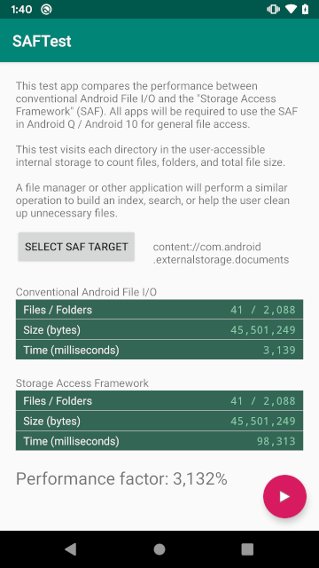

# SAFTest
Android/Java Conventional File API / Storage Access Framework Performance Test
* [Pre-built APK Download](https://github.com/cpuuntery/saftest/releases/download/releases/app-release.apk)

This is a test application to evaluate the comparative performance of
conventional Android/Java file operations vs the Android Storage Access
Framework.

This project was created to demonstrate the difference in performance
for file operations now that Android Q/10 will require file explorer
developers to use the Storage Access Framework in lieu of conventional
java.io.File access as was done with Android 1.0-9.0.

Despite being oriented toward testing Android Q/10, This application
will run on any version of Android after 5.0, when Android added support
for the Storage Access Framework.

The test walks the entirety of a folder named [speedtest]

The test counts the number of files, number of folders, and total size
of all files on the Internal Storage. A file manager app would perform a
similar walk of a directory hierarchy if it were performing a search,
checking for recently updated files, or helping the user find
unnecessary items to clean-up.

This directory-walk test is performed with both conventional Java I/O
(java.io.File operations) and with the Storage Access Framework.

The difference in performance shown by this app is what a user will
observe after upgrading his or her device to Android Q / 10 and using a
file manager which supports Android Q. (File managers which do not
specifically support Q will not have access to the user's files at all.)

  
